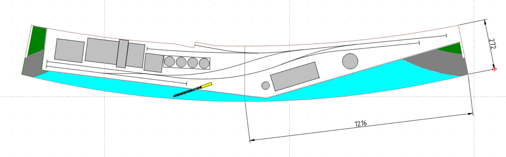
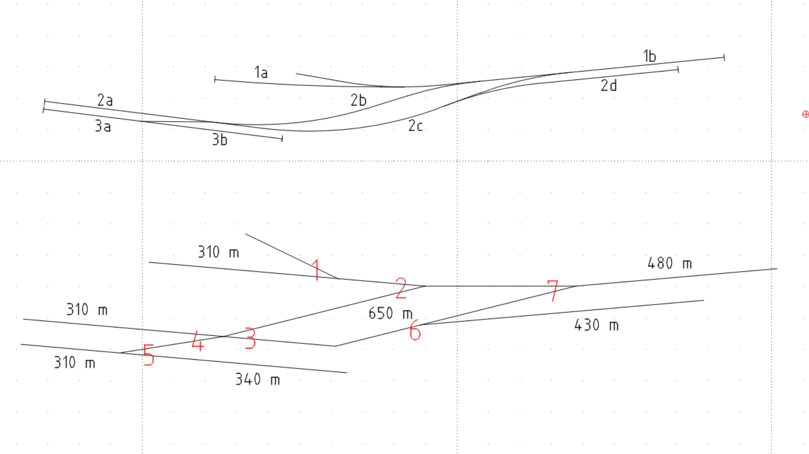
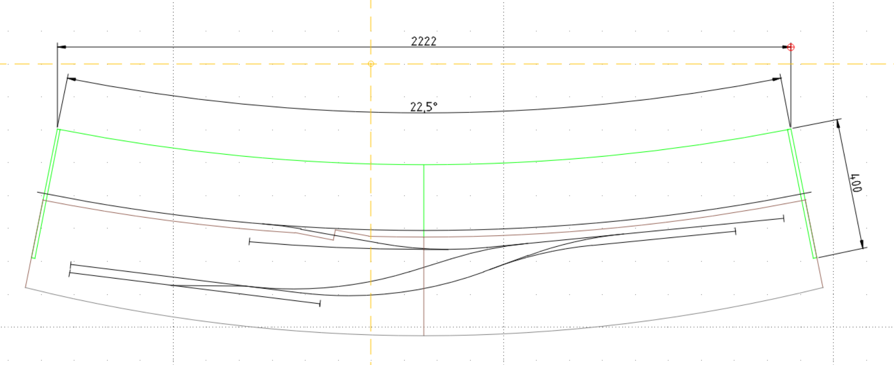
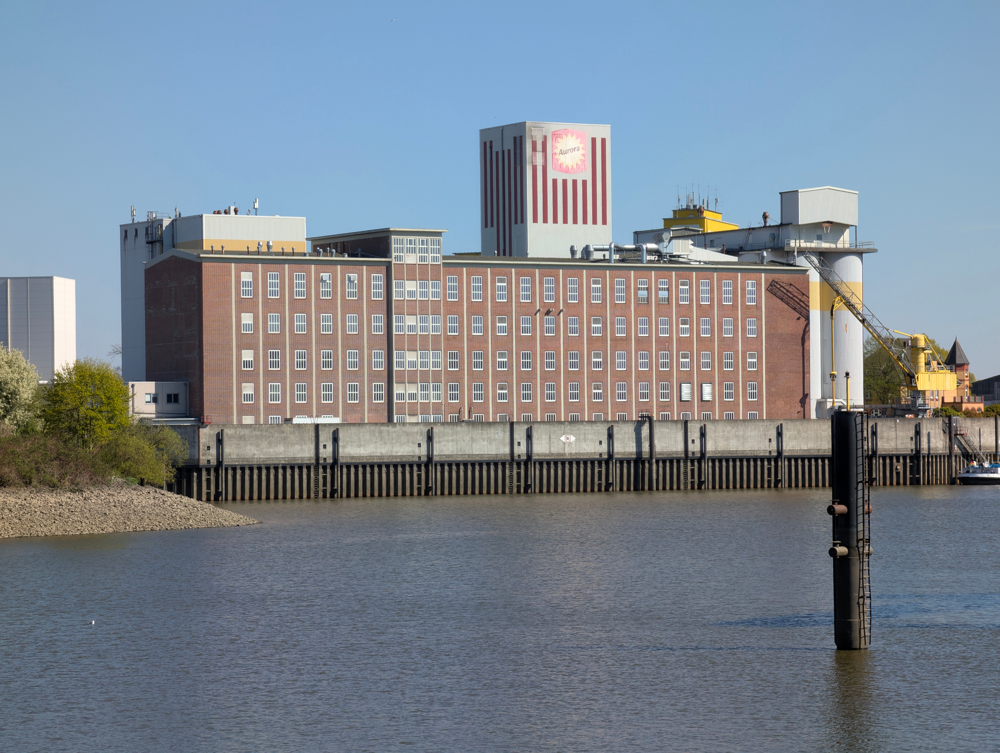
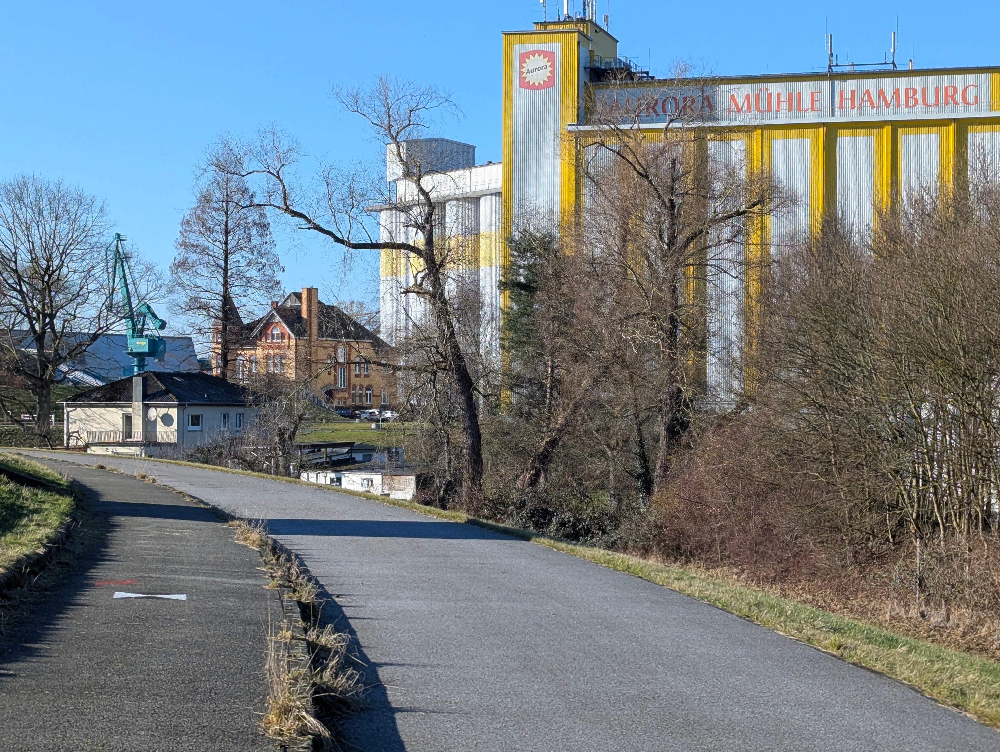
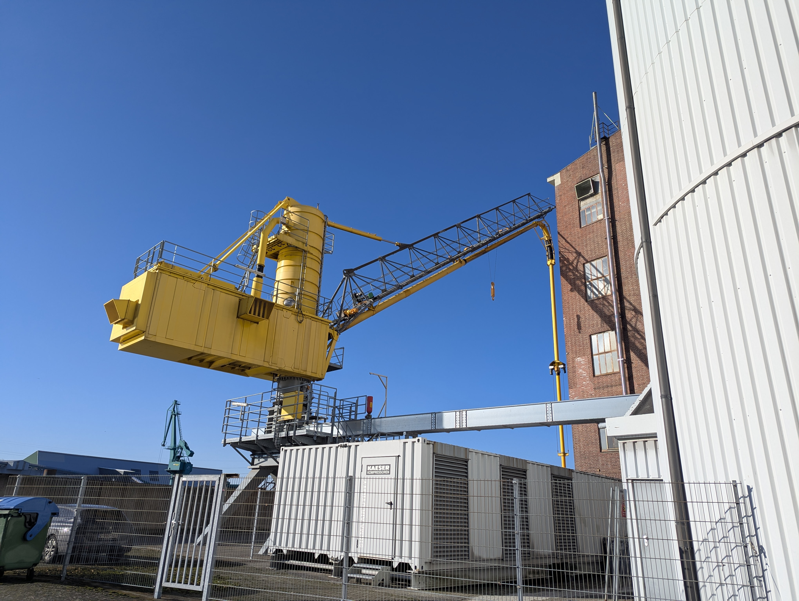
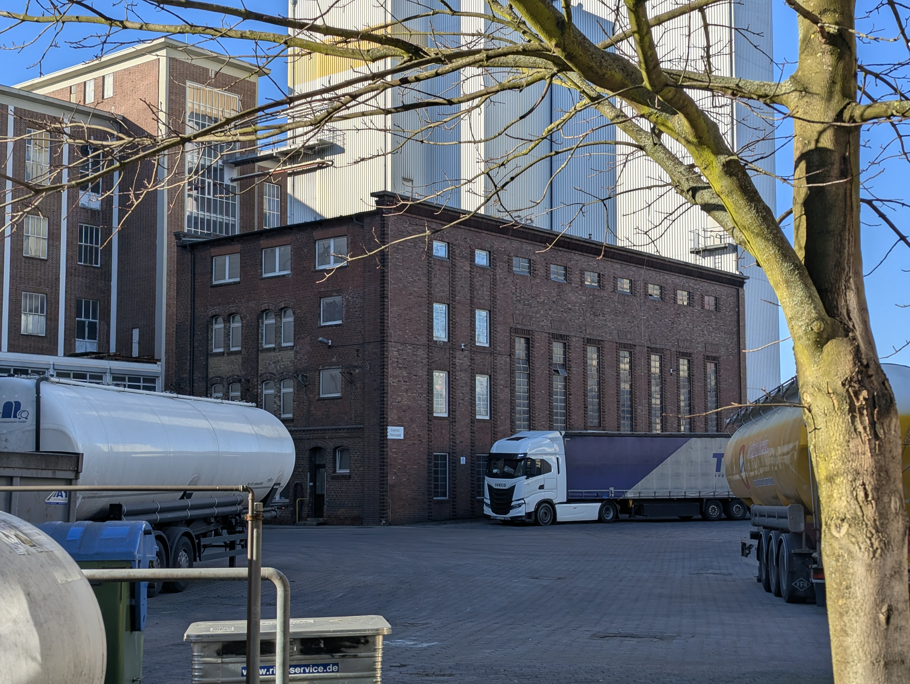
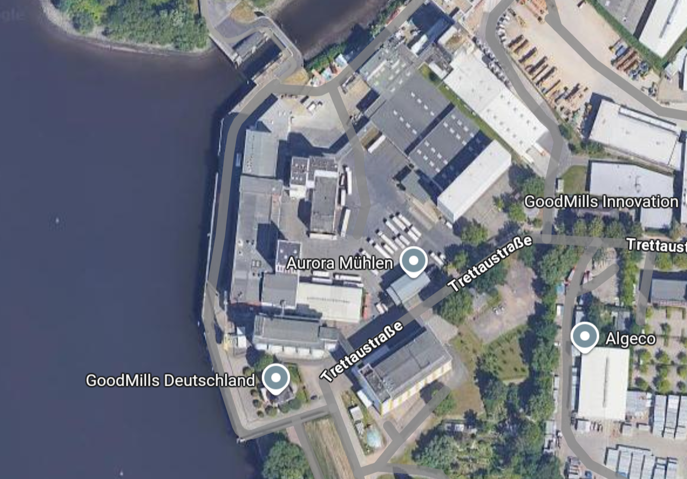

# Rubin Mill – Shunting game with FREMO connection

## The Idea

Inspired by John Whitby Allen's [Timesaver shunting
puzzle](https://de.wikipedia.org/wiki/Timesaver), I developed a concept for a
relatively small shunting game suitable for my living room. I have an ideal,
compact space on the wall for two segment boxes, each measuring approximately
120 cm by 32 cm, which can be stored vertically one above the other. For
operation, one box will be taken down and connected to the other to create the
layout.

## The Topic

My shunting game, which I will call "Rubin Mill", is inspired by the Aurora
Mühle (formerly [Diamantmehl](https://de.wikipedia.org/wiki/Diamantmehl) Mill).
This mill is located on the [Rethe](https://de.wikipedia.org/wiki/Rethe), a
connecting waterway in the Port of Hamburg, in
[Hamburg-Wilhelmsburg](https://de.wikipedia.org/wiki/Hamburg-Wilhelmsburg), and
features quay facilities.

Several parts of the complex are listed buildings (historically preserved),
which makes them attractive to replicate, including the main building
(1953/1954), the boiler house (1896/1922), a residential building (1904), and
two of five silos (silo II and silo III, 1934\)

Notably, the mill's water side is protected from flooding by a 5-metre-high
concrete wall above a sheet pile wall. However, there is no longer any railway
connection, and no visible traces of one remain.

The model is therefore, just like its name, purely imaginary. The track plan is
based on the [Timesaver by John Whitby
Allen](https://de.wikipedia.org/wiki/Timesaver).

*Fantasy logo created by Gemini AI (Nano Banana 2\)*

In the original, the main building is about 100 metres long, 20 m depth and 35 m
high. In the model, I would probably shorten it in length while taking
proportions into account. One Silo (no. III) would be reduced in size. The
concrete wall in front would be reduced in height. 

## My design

The design calls for two trapezoidal segments, with the front side concave and
the back side convex for aesthetic reasons. The tallest structure will be the
chimney at 43 cm, followed by Silo II at 34 cm and the main building at 19
cm.

Description from left to right: Embankment with greenery and slag stones, warehouse, main building, silo II, silo III, transition to further module (top), elevator (bottom) and then continue on the right segment: chimney, boiler house, heavy oil tank, embankment made of slag stones

## The Tack Layout

The track plan is inspired by the Timesaver, to be built with 190 m radii in
Code 40 track (FS160).  

## Operations

The following operating procedures are planned:

1. **Goods receipt**  
   - Grain (wheat, rye, maize) mainly by coastal motor vessel and inland
     waterway vessel at the quay  
   - Additives (baking agents, vitamins), pallets and sacks: covered goods
     wagons (Gs), track 2a  
   - Grain (wheat, rye, corn) by self-unloading wagons with swivel roofs (Ktmm,
     Tdgs), track 2b   
2. **Goods dispatch**  
   - Flour in bulk (for large bakeries), Ucs dust container wagon, track 1a  
   - Flour and bran in sacks, covered goods wagons (Gs), track 2a  
   - Mill products for export (via quay): sliding wall wagons (Hs), track 3a  
   - Direct transfer: If the mill's silos are full or the grain is not to be
     processed in this mill but sent on to another facility (e.g. inland), it is
     loaded directly from the crane into the waiting hopper wagons (Tdgs) at the
     quay, track 3b  
3. **Operating resources**  
   - Heavy fuel oil (for own power station system): Tank wagon (Z), track 2d  
   - Packaging material: sacks, pallets, cardboard boxes, covered goods wagons
     (Gs), track 2a  
   - Machine parts / maintenance: Staggered wagons (Ks) for larger plant
     components or crates, track 2c

| Freight Transport |  |  |  |  |
| :---: | :---: | :---- | :---- | :---- |
| **Track** | **Track length \[mm\]** | **Goods Receipt** | **Goods Issue** | **Wagon type** |
| 1a | 190 |  | Flour in bulk | Ucs, Uacs |
| 2a | 190 |  | Flour and bran in sacks | Gs |
| 2a | 190 | Packaging material |  | Gs |
| 2a | 190 | Additives pallets and sacks |  | Gs |
| 2b | 400 | Gain |  | Tdg, Uagpps, Tals |
| 2c | 400 | Machine parts |  | Ks |
| 2d | 265 | Heavy fuel oil |  | Z |
| 3a | 190 |  | Grain | G, Hs |
| 3a | 190 |  | Mill products for export (via quay) | Hs |
| 3b | 210 |  | Gain (direct transfer) | Tdg, Uagpps, Tals |

## Further ideas

Another idea is to create an adapter to expand the shunting game into a
single-track FREMO module showing an industrial connection at a through line. It
could look like this:  

  
*Green: FREMO module adapter, single track; brown: the two segment boxes; black:
tracks*

The FREMO module adapter will be 100 mm high, and the segment boxes will be
about 80 mm or so high, so that they can rest on the adapter in a corresponding
recess (and, of course, be secured there).

I am concerned about achieving the necessary precision for the horizontal curved
vertical contact surface, as depicted in the drawing. Nevertheless, I like the
concept of the curved track's edge aligning with the segments appealing
(referencing the Jigsaw approach, Iain Rice, *Layout Design*, 2010, page 50).

## Pictures of the role model

*View from the east: the quay and the main building (foreground, centre), Silo I
with the *Aurora* logo (centre, background), Silo II (half-right behind the main
building), Silo III (behind Silo II), elevator crane (yellow, right)*

*View from the south: \[Residential building, harbour crane (left)\], Plange's
villa (centre left), one of the newer Silos (centre), Silo III (right)*

*The elevator (grain suction device for unloading ships)*

*The boiler house (foreground, centre), the main building (left), more new silos
(background)*

*The [location in Google
Maps](https://www.google.de/maps/place/Trettaustra%C3%9Fe+49,+21107+Hamburg/@53.4938758,9.9832857,313m/data=!3m1!1e3!4m6!3m5!1s0x47b191d58cc0f8c3:0x53919d0969e482e8!8m2!3d53.4930844!4d9.9841206!16s%2Fg%2F11bw408d2s?entry=ttu&g_ep=EgoyMDI2MDIyNS4wIKXMDSoASAFQAw%3D%3D)*
