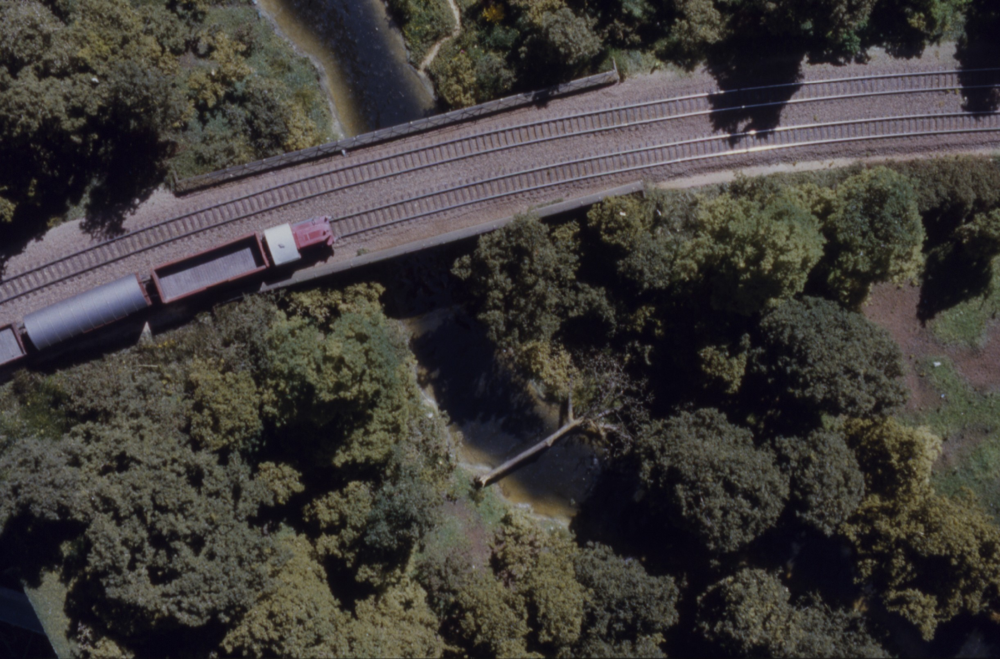

import { Badge } from '@astrojs/starlight/components';

<Badge text="This module continues to be used at FREMO events, but it has been transferred to a new owner. " variant="success" />

## The Prototype and the Model
The prototype for this module is located on the double-track main line between Hamburg and Berlin and is a brick bridge over the River *Bille* at Wohltorf. The bridge and the section of the river are reproduced in the module true to the prototype. All other elements of the module (villa, railway crossing) are purely fictional.

I built the module in the late 1990s/early 2000s as a FREMO FiNe-Scale (N gauge) model. Later, I replaced the railway barrier with one that was scale-accurate, produced using photo-etching techniques, and manually operated via a crank mechanism.

In the early 2000s, I unfortunately had no time at all for my hobbies and I decided to gave the layout in 2008 to Wim, who has lovingly looked after it ever since and regularly brings it to FREMO meetings. I am very grateful to Wim for that!

## Impressions

import { LinkCard } from '@astrojs/starlight/components';

<LinkCard title="Detaillierter Artikel zur Konstruktion des Modulkastens für Wohltorf (german only)." href="/Modulkasten.pdf" />