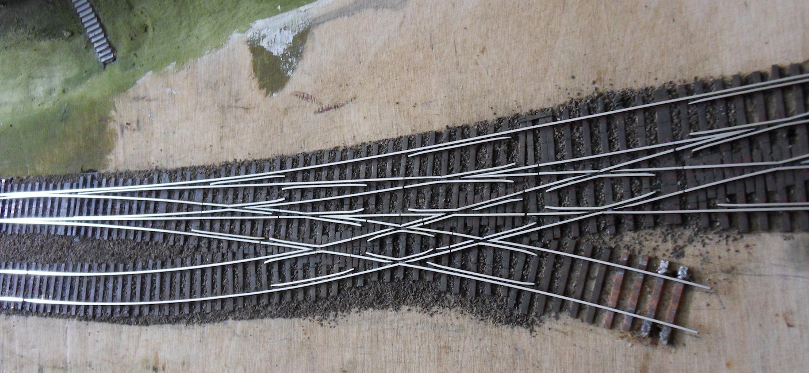

 ## Model railways as a hobby – isn’t that a bit uncool and stuffy?
Short answer: No!

Long answer: I’m fascinated by the diversity of this hobby. A successful model railway is a blend of research into the real-life prototype, imagination, design, precision metalwork and engineering, woodwork, electrical and electronic engineering, digital technology, IoT, graphics, painting, modelling and sculpting. 

Of course, you can also play with a model. And here, too, there is a huge variety. Solving shunting puzzles on a small scale at home on your own, or on a really large scale with lots of people at [Fremo](https://www.fremo-net.eu/): we hire a large hall and assemble a layout from model railway modules with matching end profiles. Trains then travel loooong distances – according to the timetable.

 
*“FREMO Annual Conference 2016 in Riesa – various modular layouts in an exhibition hall” by [Julia Freeman](http://photos.quixotic.eu) - [http://photos.quixotic.eu/FREMO/Riesa-2016-09/](http://photos.quixotic.eu/FREMO/Riesa-2016-09/), [CC BY-SA 3.0](https://commons.wikimedia.org/w/index.php?curid=72345445)*

## FiNe-Scale
FiNe-Scale (or FS160) is model railway construction on a scale of 1:160 (N gauge, 9 mm track gauge), with high standards of prototypical accuracy, scale and visual appearance. Technically, this primarily concerns the wheel-rail system, but ultimately all aspects of model building, from track layout and landscape design to the construction of carriages and locomotives, right through to prototypical operation.

## FS160 Track Construction
N-gauge models bought in shops are usually built to NEM standards (Normen Europäischer Modellbahnen – *European Model Railway Standards*). N-gauge was standardised in the mid-1960s as a toy scale designed to allow for very small track radii (around 20 cm). Compared to the prototype, this necessitates significant compromises in the precision of the wheel-rail system, resulting in wheels that are very wide and rails and flanges that are excessively high.

FiNe-Scale track, including turnouts, are not available in shops and is built by the model makers themselves. The radii are large, true to the prototype (from around 120 cm upwards). Wheels are 1.3 mm wide (instead of approx. 2 mm according to NEM), flange grooves are 0.5 mm (instead of 1 mm), and the rail height is 1 mm (instead of approx. 2 mm).

You can see just how beautiful such tracks and points look on [Henk Oversloot’s FS160 website](https://www.fs160.eu/):

*“Complex Junction” by [Henk Oversloot](https://www.fs160.eu/) – [https://www.fs160.eu/fiNeweb/standards/trackcon/complexjunction.jpg](https://www.fs160.eu/fiNeweb/standards/trackcon/complexjunction.jpg), [CC BY-NC-SA 3.0](https://creativecommons.org/licenses/by-nc-sa/3.0/)*

## FREMO
The members of the association [Freundeskreis Europäischer Modellbahner (FREMO)](https://www.fremo-net.eu/) regularly organise the module meetings mentioned above. 

### The modular principle

Instead of a permanent layout in their own basement, each participant builds one or more modules. These are standardised segments (e.g. 1 metre long) with standardised profiles at the ends.

- The key feature: as everyone adheres to the same technical standards, the modules can be assembled at a meeting to form a huge, often hundreds of metres long, complete layout.

- The layout: The layout is usually point-to-point (i.e. no roundabouts) and winds its way through large sports halls or town halls.

### Operation just like the real thing

A FREMO meeting is not a ‘show run’ where trains simply roll round in circles. Real railway operations are simulated:

- Timetable: There is a fixed visual timetable. Every train has a number, a fixed departure time and a mission.

- Staff: Participants take on roles such as locomotive driver, signalman (at the station) or shunter.

- Freight operations: Using small wagon cards and consignment notes, the process of freight wagons being transported from A to B, unloaded there and later collected again is simulated.

### Technology and scales

To ensure everything runs smoothly, there are rules:

- Scales: The most common is H0 (1:87), but there are also gatherings for N (1:160), FiNescale (FS160), 0 (1:45) or narrow gauge.

- Control: Operation is digital (usually via DCC), with each locomotive driver using their own hand controller (‘Fred’) and physically accompanying their train throughout the entire layout.

- Model building: Great importance is placed on high-quality design and realistic track geometry.

### The atmosphere

A meet usually lasts several days (often over a long weekend). It is a mix of focused work, play, technical discussion and a cosy get-together.

- Important to know: These meets are usually not open to the public. They are intended for members to play together. Anyone wishing to watch often has to register in advance or request guest status, as the ‘players’ are fully immersed in their timetable.